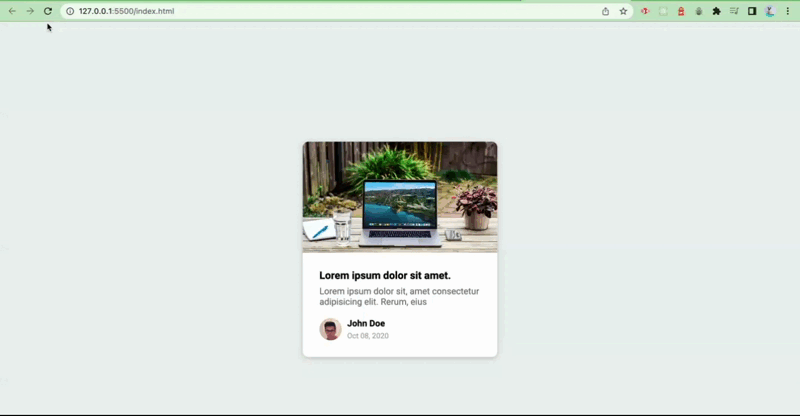

# Content Placeholder

## Description

Description
Content Placeholder is a simple HTML, CSS, and JavaScript project that displays a card with an image, title, small information, and a randomly generated user image with their name and date of birth. The project includes a loading animation that is shown for 2.5 seconds (2500 milliseconds) when the page is refreshed or opened for the first time.

## DEMO

## Installation

To use the Content Placeholder project, follow these steps:

1. Clone the repository or download the project files.
2. Open the project directory on your local machine.

## Usage

1. Open the index.html file in your preferred web browser.
2. The card with placeholder content will be displayed initially.
3. After 2.5 seconds, the content will be populated with random user data, including an image, name, and date of birth.

## Customization

If you wish to customize the Content Placeholder project, you can modify the following files:

1. `index.html`: This file contains the structure of the card and the loading animation.
2. `styles.css`: Use this file to modify the appearance of the card, such as colors, fonts, and layout.
3. `script.js`: Here, you can change the behavior of the card, such as the loading time, data generation, or add additional functionality.

## Contributing

Contributions to this project are welcome. If you find any issues or have suggestions for improvements, please open an issue or submit a pull request on the project's GitHub repository.
